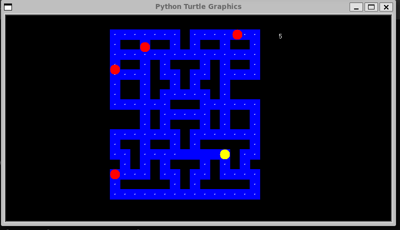

Pacman developed by Ali Onuche John

The Pacman is a classic arcade game that was first released in 1980 by Namco. 
Created by Toru Iwatani, Pacman quickly became one of the most iconic and recognizable video games in the world. 
It was initially designed for arcade machines but has since been adapted to various platforms and remains popular through different versions and adaptations.

Gameplay:
The gameplay of Pacman is simple yet addictive. The player controls a character known as "Pacman," a yellow, circular creature with a mouth. 
The game is set in a maze filled with dots, and the objective is to navigate Pacman through the maze while eating all the dots. As Pacman moves, 
he is pursued by four ghosts—Blinky, Pinky, Inky, and Clyde—that aim to capture him. The player must avoid these ghosts, as being caught results in losing a life.

Special items, such as larger dots called "Power Pellets," are scattered throughout the maze. 
When Pacman consumes a Power Pellet, the ghosts turn blue, and Pacman gains the ability to eat them for extra points. 
The ghosts eventually return to their normal colors and resume chasing Pacman.

The game continues through various levels with increasingly challenging mazes and faster-paced gameplay. 
Additional elements, like fruits and bonus items, appear to provide extra points.

Legacy:
Pacman's design and simple yet engaging gameplay contributed significantly to its success. 
The game's distinctive characters, catchy music, and innovative concept helped establish it as a cultural icon in the gaming industry. 
Pacman has been widely ported to numerous platforms, and its influence can be seen in various aspects of popular culture.

Over the years, Pacman has inspired sequels, spin-offs, merchandise, and even an animated television series. 
The game's design and characters have become enduring symbols of the early days of video gaming, and Pacman 
remains a nostalgic favorite for many gamers around the world.

To Run the script:

1) Convert it to an executable file using the script chmod +x pacman.py
2) Then run it using ./pacman.py

Alternatively you can run the script by the command
python3 pacman.py

Thank you
John Ali
alionuche2008@gmail.com
LinkedIn: https://www.linkedin.com/in/john-ali-software-developer/
